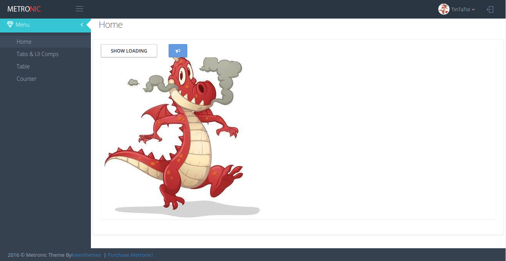
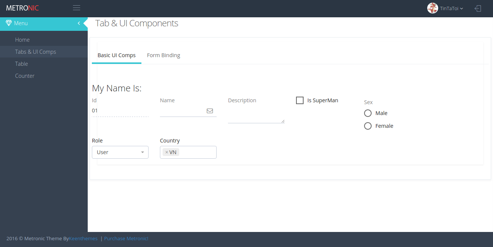
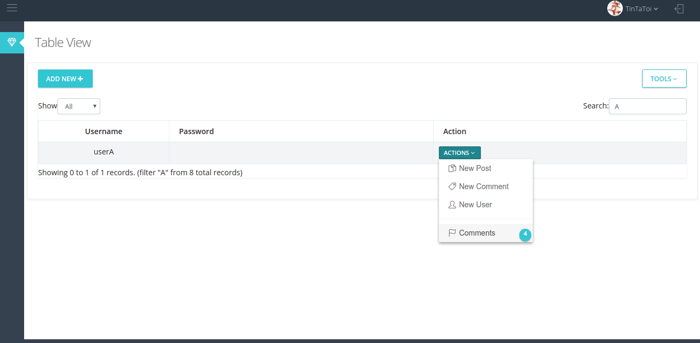

# Metronic Dashboard Template

Metronic dashboard template base on [React Redux Starter Kit](https://github.com/davezuko/react-redux-starter-kit)






## Installation

- Buy license of [Metronic theme](http://keenthemes.com/preview/metronic/)
- Copy Metronic *assets* folder to src/static
- Run install and start script

```
  npm install & start
```
## Source Generator
```
  npm generate
```

Supporting Types:
  - Components: Generate new Components `[Es6Class | Stateless]`
  - Reducer & Action: (WIP)
  - Routes: (WIP)

## Todo
- CLI Tool Generate Reducer & Action
- CLI Tool Generate Routes `([Empty | BaseView] -> [hasReducer | None])`
- Add UserInfo Reducer (useGeneralInfo, token, ....)
- Add Basic CURD Data Model Template

## Done
- ~~Core layout~~
- ~~Top Bar~~
- ~~Side Bar~~
- ~~Essential utils Loading, alert Utils~~
- ~~Base Container for new Page~~
- ~~Modal Container~~
- ~~Basic Components (Button, Tab, Input)~~
- ~~DataForm Components (sync with obj props)~~
- ~~Table Components~~
- ~~CLI Tool Generate Components `([Es6Class | Stateless])`~~
- ~~Organize Reducers,Actions~~
